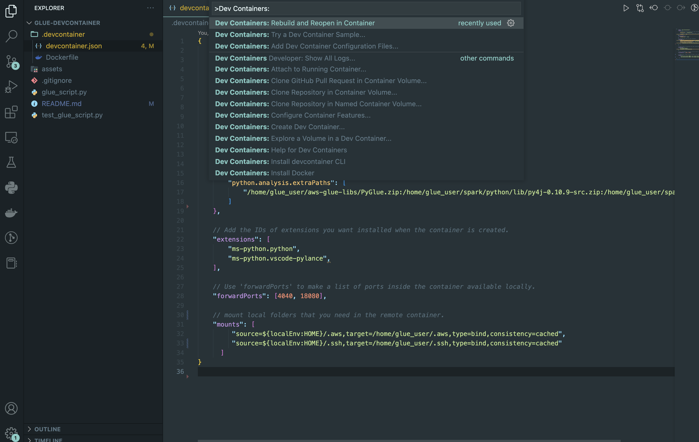

# Glue Devcontainer

This repo showcases how you can use a VS Code devcontainer to test and debug your Glue 3.0 script locally.

## Links

Got inspiration from [aws blog for testing glue](https://aws.amazon.com/blogs/big-data/develop-and-test-aws-glue-version-3-0-jobs-locally-using-a-docker-container) and [vs code devcontainers](https://code.visualstudio.com/docs/devcontainers/containers)


## Setup

- Make sure Docker is running on your laptop.
- Open VS Code and install "Remote Development" plugin.

- CMD + Shift + P > Dev Container: Rebuild and Reopen in Container.


## Run glue_script.py
- Open [glue_script.py](glue_script.py) > Run > Start Without Debugging.
- Or from the terminal run `spark-submit /home/glue_user/workspace/glue_script.py`.

## Debug glue_script.py
- Left click to add a breakpoint (red dot) next to the line number you want to inspect.
- Run > Start Debugging > current file
- You can inspect variables on the left pane.
- You can execute statements in the "Debug Console" in the pane below.


## Tests

- CMD + Shift + P > Python: Configure Tests > pytest > select the folder containing the tests (here root '.')
- In the testspane on the left you can select your tests and run or debug them.


## Spark UI
http://localhost:4041/jobs/


## CICD

You can run the tests in your CICD system using the following command.
```bash
PROFILE_NAME=default
docker run -it -v ~/.aws:/home/glue_user/.aws -v $PWD:/home/glue_user/workspace/ -e AWS_PROFILE=$PROFILE_NAME -e DISABLE_SSL=true --rm -p 4040:4040 -p 18080:18080 --name glue_pytest amazon/aws-glue-libs:glue_libs_3.0.0_image_01 -c "python3 -m pytest --disable-warnings"
```
<details>
<summary> Output of command</summary>


```bash
starting org.apache.spark.deploy.history.HistoryServer, logging to /home/glue_user/spark/logs/spark-glue_user-org.apache.spark.deploy.history.HistoryServer-1-1c10b4d7ca53.out
====================================================== test session starts =======================================================
platform linux -- Python 3.7.15, pytest-6.2.3, py-1.11.0, pluggy-0.13.1
rootdir: /home/glue_user/workspace
plugins: anyio-3.6.2
collected 1 item                                                                                                                 

test_glue_script.py .                                                                                                      [100%]

================================================= 1 passed, 1 warning in 20.19s ==================================================
```


</details>
